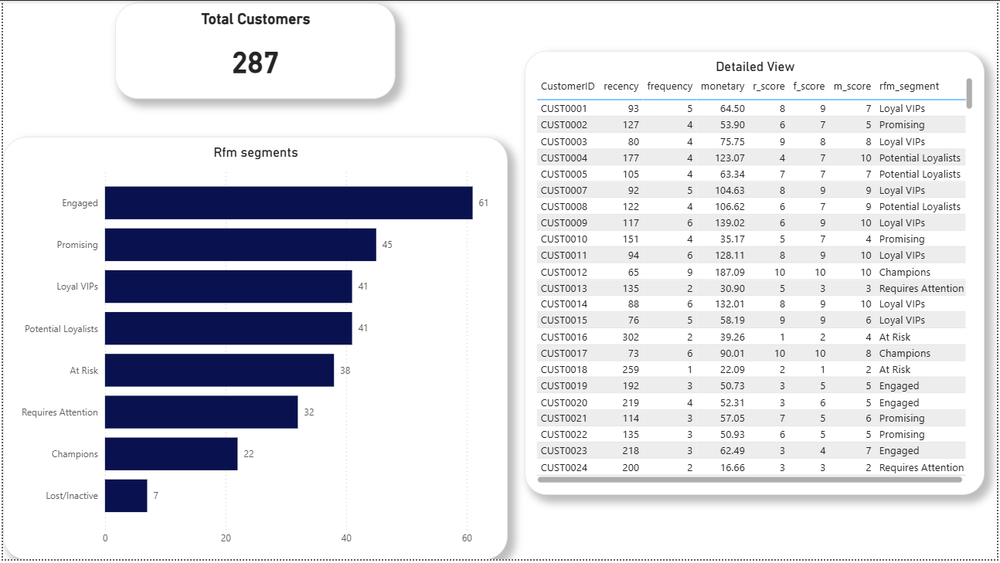

# RFM Customer Segmentation - BigQuery & Power BI

## Project Overview

This project analyzes customer purchasing behavior using **RFM analysis** with **BigQuery SQL** and **Power BI**.

RFM stands for:

- **Recency** → How recently a customer placed an order
- **Frequency** → How often a customer places orders
- **Monetary** → How much a customer spends

The goal of the project is to segment customers into meaningful business groups based on purchasing behavior.

The final segments include:

- Champions
- Loyal VIPs
- Potential Loyalists
- Promising
- Engaged
- Requires Attention
- At Risk
- Lost/Inactive

This type of analysis helps businesses better understand customer value and improve retention and marketing strategies.

---

## Project Workflow

The project follows this pipeline:

Monthly CSV Files  
→ BigQuery Monthly Tables  
→ Combined 2025 Sales Table  
→ RFM Metrics View  
→ RFM Scores View  
→ Total RFM Scores View  
→ Final Customer Segments Table  
→ Power BI Dashboard

---

## Dataset

The dataset consists of **12 monthly CSV files** covering customer sales activity across **2025**.

Each file contains the following fields:

- `OrderID`
- `CustomerID`
- `OrderDate`
- `ProductType`
- `OrderValue`

---

## SQL Workflow

The SQL process includes:

- Appending all monthly sales tables into one yearly table
- Calculating RFM metrics for each customer
- Ranking customers by recency, frequency, and monetary value
- Assigning decile scores from **1 to 10**
- Creating a total RFM score
- Mapping customers into final business segments

---

## Customer Segments

Customers are grouped into the following segments based on their total RFM score:

- **Champions**
- **Loyal VIPs**
- **Potential Loyalists**
- **Promising**
- **Engaged**
- **Requires Attention**
- **At Risk**
- **Lost/Inactive**

---

## Dashboard Overview

The Power BI dashboard includes:

- **Total Customers KPI**
- **Customer count by RFM segment**
- **Detailed customer segmentation table**
- **Percentage distribution by segment**

---

## Dashboard Preview



The dashboard provides a clear view of customer distribution across segments and supports business-focused customer analysis.

---

## DAX Measure Used

The Power BI report includes a measure to calculate total customers:

```DAX
Total Customers = CALCULATE(DISTINCTCOUNT(Query1[CustomerID]), ALL(Query1))
